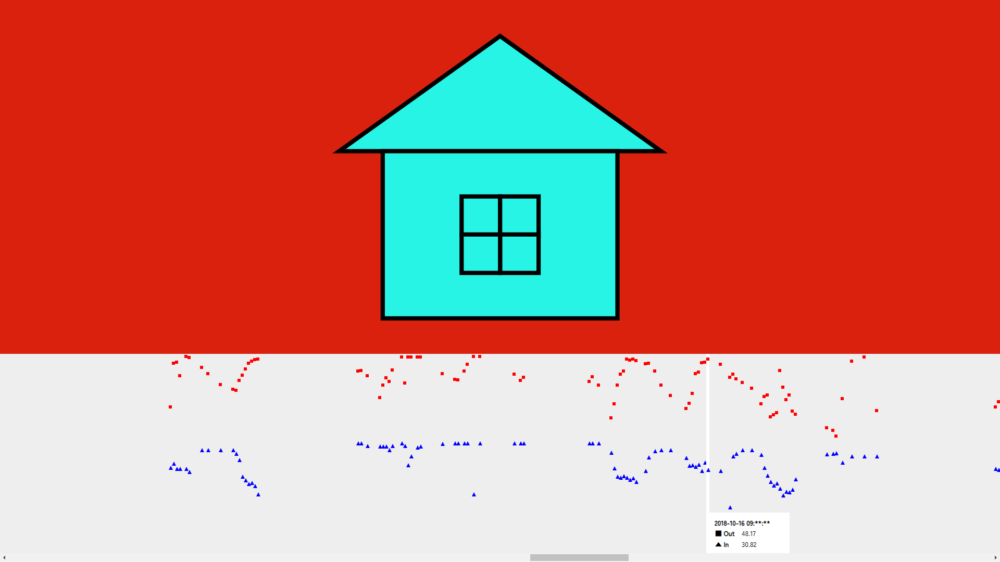

本プロジェクトは，Kaggle で公開されている [Temperature Readings : IOT Devices](https://www.kaggle.com/datasets/atulanandjha/temperature-readings-iot-devices/data) のデータセットをインタラクティブに可視化する Web アプリケーションです．GitHub Pages により https://pro-ktmr.github.io/visualize-temperature-readings-from-iot-devices/ で公開されています．Kaggle からご自身でデータセットをダウンロードの上，サイトでファイルをアップロードしてご利用ください．

